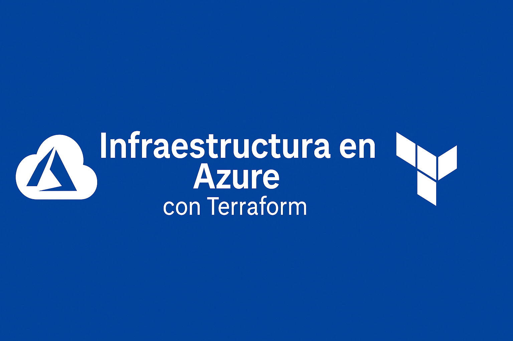

# ☁️ Terraform - Infraestructura en Azure

Este proyecto crea una infraestructura básica en Microsoft Azure usando Terraform.  
Ideal para practicar despliegues reales en la nube.

---

## 🧱 Recursos que se crean

- Grupo de recursos (`Resource Group`)
- Red virtual y subred
- Interfaz de red (NIC)
- Máquina virtual Linux (Ubuntu)

---

## 🔧 Requisitos

- Tener una cuenta en [Azure](https://portal.azure.com/)
- Tener instalado:
  - [Terraform](https://www.terraform.io/)
  - [Azure CLI](https://learn.microsoft.com/es-es/cli/azure/install-azure-cli)

---

## 🚀 ¿Cómo usarlo?

1. Autenticarse en Azure:

```bash
az login
